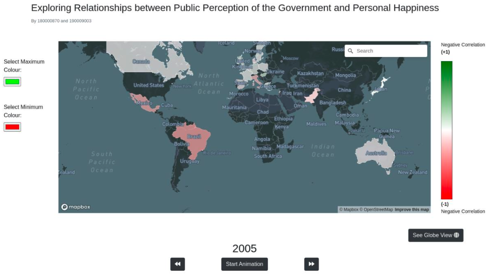
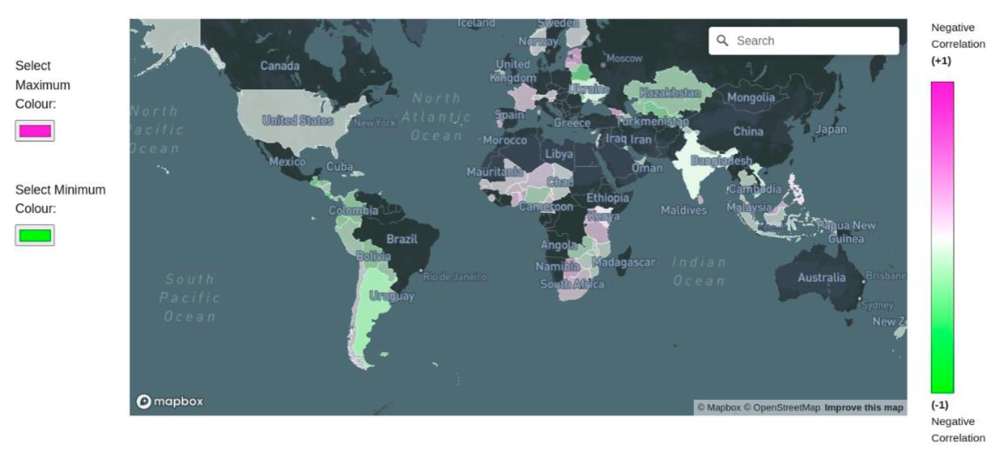
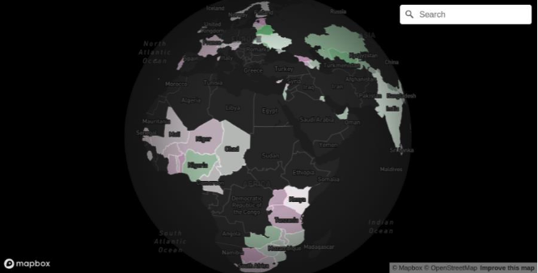

# Government Effectiveness & Happiness Data Visualization

An interactive web-based data visualization exploring the relationship between public perception of government effectiveness and personal happiness across countries and time periods (2005-2021).



## About This Project

This interactive data visualization project combines data from the **World Happiness Report** and the **World Governance Indicators** to investigate whether public perception of government effectiveness correlates with personal happiness levels.

### Key Features

- **Interactive Choropleth Map**: Visualize correlation patterns across 128+ countries
- **Time-based Animation**: Explore trends from 2005 to 2021
- **Customizable Color Scales**: Accessibility features for color-deficient users
- **Multiple Map Projections**: Switch between Mercator and Globe views
- **Detailed Country Views**: In-depth analysis with infographics, treemaps, and line graphs
- **Responsive Design**: Works across different screen sizes

## 📊 Research Questions

This visualization was designed to answer two key questions:

> **Primary Question:** "Does the public's perception of the effectiveness of its government correlate with their personal happiness?"

> **Secondary Question:** "Can we identify geographical trends in these correlations across different regions?"

### Methodology

The visualization maps the difference between normalized Government Effectiveness (GE) and Life Ladder (LL) scores, producing values in the [-1, 1] range where:

- **0** indicates strong positive correlation
- **-1** indicates high government effectiveness but low happiness
- **+1** indicates low government effectiveness but high happiness

By exploring the interactive choropleth map and country-specific details, users can discover patterns and regional trends that answer these research questions.

## 🚀 Quick Start

### Prerequisites

- A modern web browser (Chrome, Firefox, Safari, or Edge)
- A Mapbox access token ([get one free here](https://account.mapbox.com/access-tokens/))
- VS Code with Live Server extension (recommended) or any local web server

### Installation

1. Clone the repository

2. Set up your Mapbox token:

```bash
cd src/js
cp config.example.js config.js
```

3. Edit `src/js/config.js` and replace `YOUR_MAPBOX_TOKEN_HERE` with your actual Mapbox token:

```javascript
const CONFIG = {
  MAPBOX_TOKEN: "your_actual_token_here",
};
```

4. Start a local web server:

   **Option A - VS Code Live Server:**

   - Open the project in VS Code
   - Navigate to `src/index.html`
   - Right-click and select "Open with Live Server"

   **Option B - Python:**

   ```bash
   cd src
   python3 -m http.server 8000
   ```

   Then visit `http://localhost:8000`

   **Option C - Node.js:**

   ```bash
   npx http-server src -p 8000
   ```

5. Open your browser to the local server and navigate to `index.html`

## 📁 Project Structure

```
CS5044_P2/
├── src/
│   ├── index.html                  # Landing page
│   ├── html/
│   │   ├── homepage.html          # Main choropleth visualization
│   │   └── individualCountry.html # Detailed country view
│   ├── css/
│   │   ├── homepage.css
│   │   └── individualCountry.css
│   ├── js/
│   │   ├── config.js              # API keys (git-ignored)
│   │   ├── config.example.js      # Configuration template
│   │   ├── homepage/
│   │   │   ├── chloropleth_map.js
│   │   │   ├── colour_scale.js
│   │   │   ├── data_cleaning.js
│   │   │   ├── map_event_handler.js
│   │   │   └── animation_event_handlers.js
│   │   └── individualCountry/
│   │       ├── data_processing.js
│   │       ├── dataKeyHandling.js
│   │       ├── drawHelperFunctions.js
│   │       ├── individualCountry.js
│   │       └── infographics.js
│   └── data/
│       ├── world_bank.csv
│       ├── WorldHappinessRaw.csv
│       └── wgidataset_stata/
├── README.md
└── .gitignore
```

## 🎨 How to Use

### Main Choropleth Map

1. **Navigate**: Drag, zoom, and pan the map to explore different regions
2. **Search**: Use the search bar to find specific countries
3. **Customize Colors**: Use the color pickers on the left to adjust the color scale for accessibility
4. **Animate**: Use the timeline controls to see changes over time (2005-2021)
5. **Switch Views**: Toggle between Mercator projection and Globe view
6. **Explore Details**: Click any country to view detailed statistics

### Country Detail View

- View infographics comparing the country to global averages
- Interact with circular treemaps to select data attributes
- Customize the line graph to compare different metrics over time
- Use the year slider to filter data

## 📚 Data Sources

1. **World Happiness Report** (2005-2021)

   - Source: [worldhappiness.report](https://worldhappiness.report/)
   - Key Metric: Life Ladder (0-10 scale of life satisfaction)

2. **World Governance Indicators** (1996-2021)
   - Source: [World Bank WGI](https://info.worldbank.org/governance/wgi/)
   - Key Metric: Government Effectiveness (perception of public service quality)

## 🔧 Technologies Used

- **D3.js v7** - Data visualization and DOM manipulation
- **Mapbox GL JS v3** - Interactive maps
- **Bootstrap 4** - Responsive UI framework
- **jQuery** - DOM utilities
- **Font Awesome** - Icons

## 🔍 Key Insights

Based on the visualization analysis:

- **Strong correlation** exists in North America and Europe between government effectiveness and happiness
- **South America** shows a trend of higher happiness despite lower government effectiveness scores
- **First-world countries** are more likely to show correlation between these metrics
- **Maximum difference** between GE and LL globally is less than 0.5, suggesting GE is a significant but not sole contributor to happiness

## 🛠️ Development Notes

### Design Decisions

- Used Mapbox layers directly instead of SVG overlays for better performance and flexibility
- Implemented diverging color scale (red-white-green) following standard conventions
- Added color customization for accessibility (8-10% of males have color deficiency)
- Used Bootstrap for responsive design across devices

### Known Limitations

- Country comparisons require memorizing data between views (violates "eyes beat memory" principle)
- Data processing is repeated on both pages due to JS limitations
- Future improvement: Combine pages into unified dashboard

## 📸 Additional Screenshots

### Custom Color Scale



_Users can customize the color scale for accessibility or personal preference_

### Globe View



_Alternative globe projection for better geographic context_

## 📄 License

MIT License - See LICENSE file for details

## 🙏 Acknowledgments

- World Happiness Report team
- World Bank Governance Indicators team
- Mapbox for map infrastructure
- D3.js community

---

**Note**: This project was completed in 2023. While the visualization techniques remain relevant, some data may be outdated. The most recent data available is from 2021.
